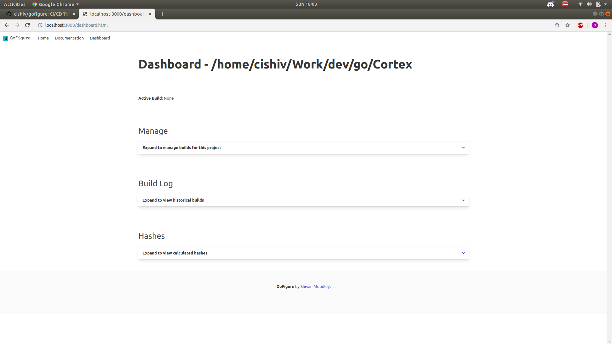
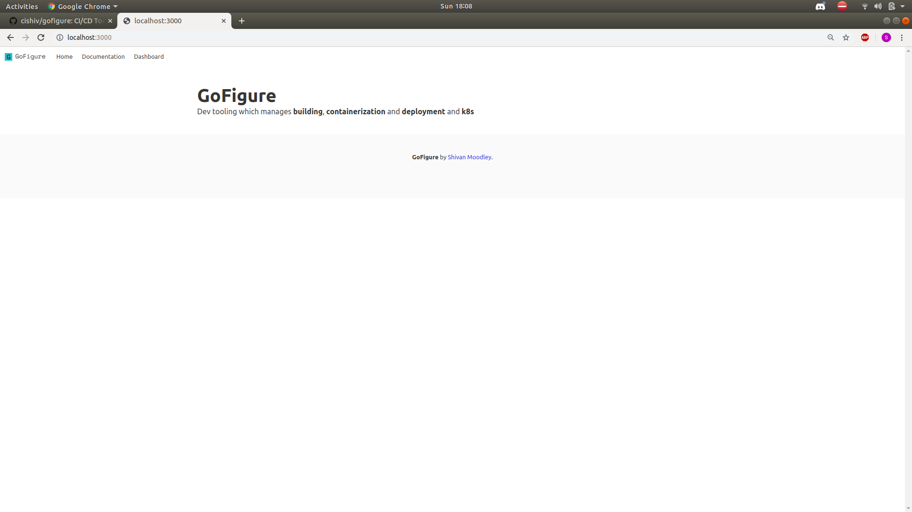
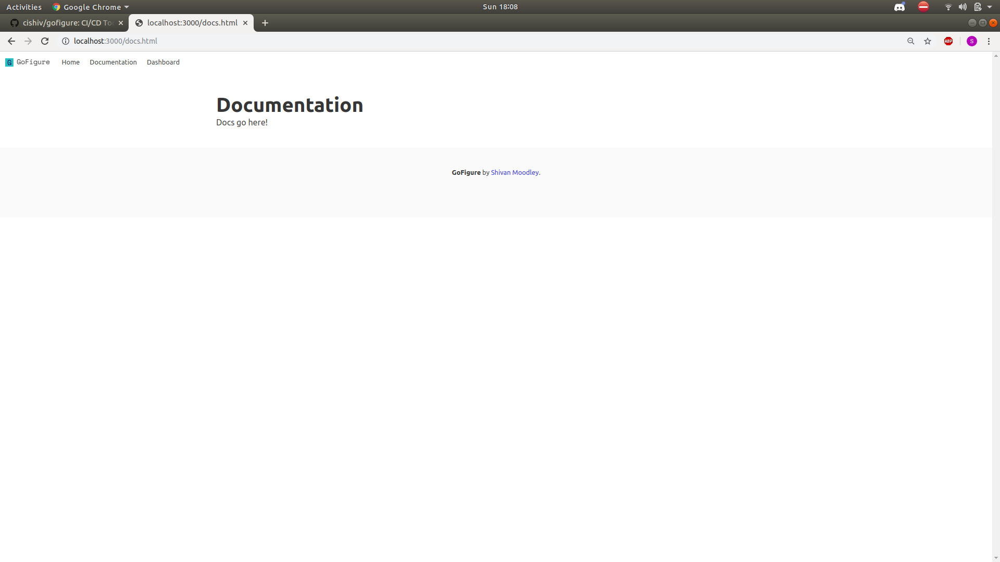
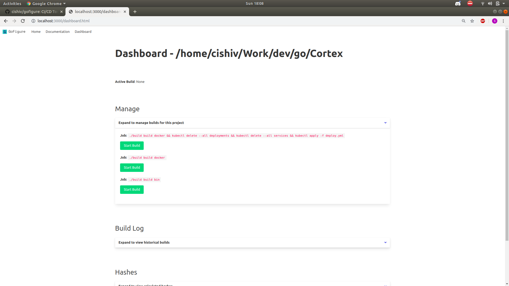
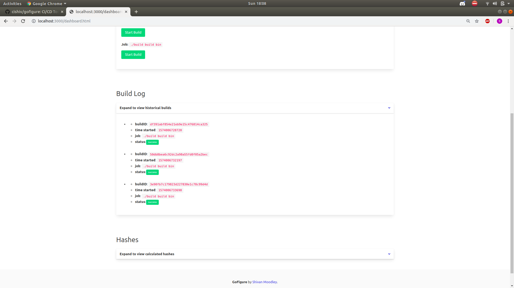
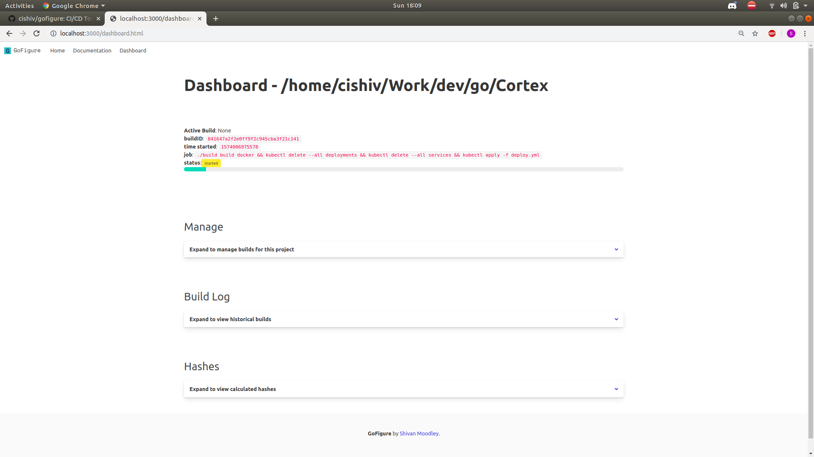
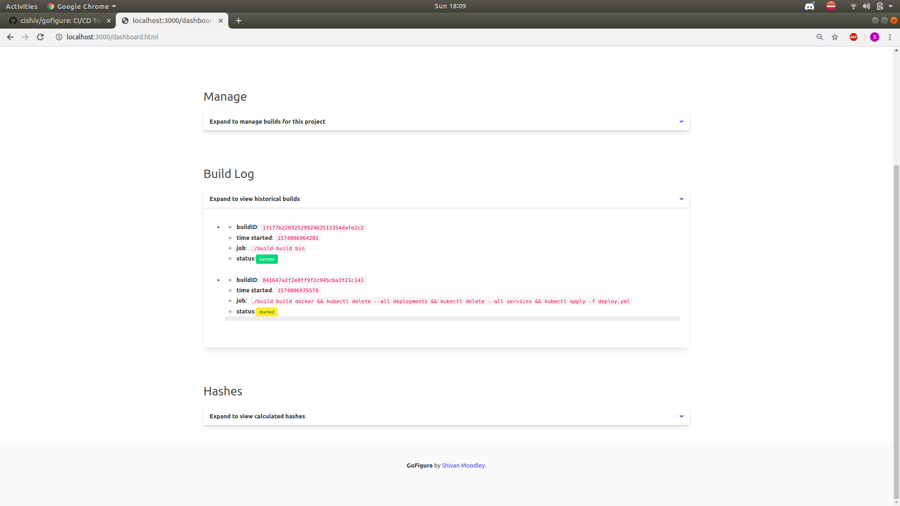

# Basic CI/CD Pipeline for Local Dev

"CI/CD, but worse"



// FIXME - Infinite build loop if builds are manually initiated, I know how fix it, but it'll have to wait for now

This is extremely specific to my setup for the moment.

My current development environment is using Docker and Minikube, with a custom .sh build script
to create my Go binaries and Docker images.

Even though the builds are fast and the scripts are pretty cool, it can be pretty manual and monotonous
for fast testing.

I wrote this little app that can run in a seperate tmux tab to `watch` the current directory and compute hashes on files. The `watch` time is set to 2 seconds which is insanely low, more reasonable would be around 1 - 3 minutes.

It uses [Bitcask](github.com/prologic/bitcask) as a key/value store to keep a registry of files and hashes. The files are the key since we use the absolute path. 

When a hash change is detected for a file, we run:

`./build build docker && kubectl delete --all deployments && kubectl delete --all services && kubectl apply -f deploy.yml` 

which is a set of commands specific to bootstrapping an enviroment for [Cortex](github.com/cishiv/Cortex) (currently a private repo) 

`./build build docker` is a custom build script for the Cortex project.

## Extensions

I will probably extend this and make it more configurable as needed. But it serves my purpose for the moment.


## Proposed Design

You should be able to configure job files (gofigure-{job_name}.json) that contain the stages for this job

example
-------

gofigure-cortex.json -> `parse stages and then run them, if strictDepedency is true, then the stages are effectively chained with &&`
```
{
	"jobType" : "build,test,deploy"
	"jobStages" : [
		"path/to/build/stage1",
		"path/to/build/stage1",
		"path/to/build/stage1"
	],
	"strictDependency" : true,
	"automated" : true,
	"watchFunction" : "file_hash"
}
```

stage-build.json -> `docker build -t {image-name}:{tag} .`
(not sure yet on ideal image tagging, but probably md5 hashing based on the file location and current sys time for default, of course
configuration would be allowed)
```
{
	"stage" : "build"
	"target" : "docker"
	"source" : "Dockerfile"
	"locations" ["path/location1", "path/location2"]
	"stageExecution" : "default", // can be ./bin/bash {script}
}
```

stage-test.json  -> `cd /path/location(s) __test__`
```
{
	"stage" : "build"
	"target" : "go_test"
	"source" : ".*test.*.go"
	"locations" ["path/location1", "path/location2"],
	"stageExecution" : "default", // can be ./bin/bash {script}
}
```

stage-deploy.json -> `kubectl apply -f {source}`
```
{
	"stage" : "build"
	"target" : "kubernetes"
	"source" : ".*deploy.*.yml"
	"locations" ["path-to-descriptor/location1", "path-to-descriptor/location2"]
	"stageExecution" : "default", // can be ./bin/bash {script}
}
```
user interface
--------------

it might be worthwile to have a lightweight user interface that allows for job monitoring and configuration

packaging
----------
would be ideal if this can be packaged into a single docker image, that could be run even if it wasn't in a specific directory.

jobTypes
---------
- checkout -> clone vcs (not yet designed) (probably only when this runs in docker)
- build -> produce binaries/images
- test -> run test suite
- deploy -> propogate into an environment (for the moment we target kubernetes)


## Screenshots

Just some screenshots for the initial UI I built using vanilla JS and Bulma







